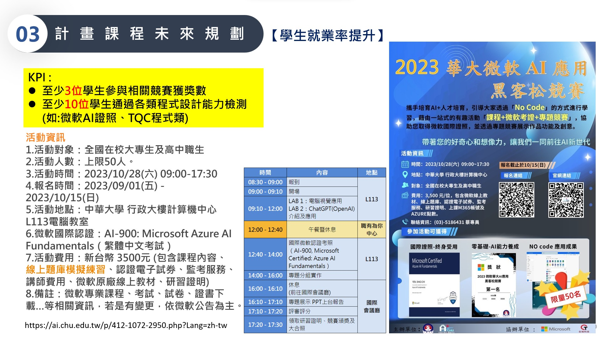
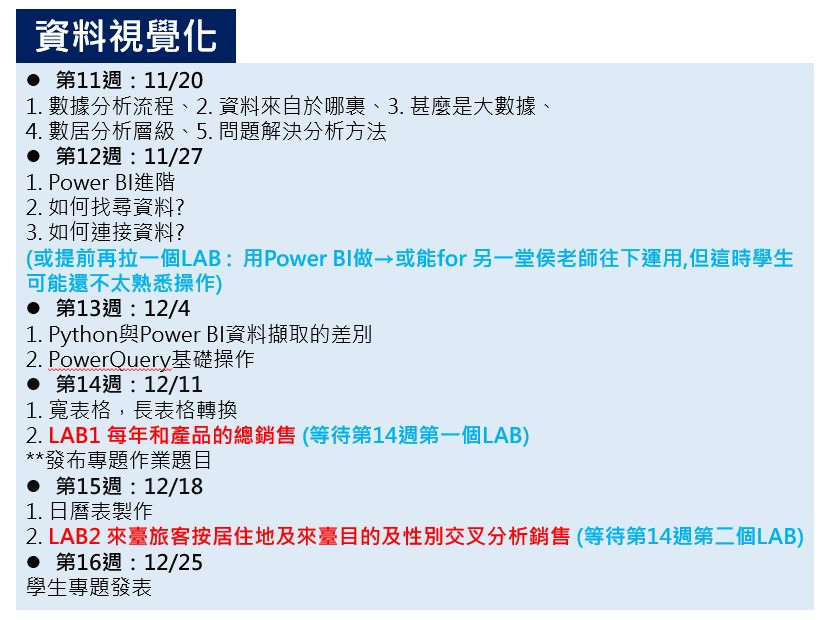

# 112 教育部智慧創新計畫
<a href="http://140.126.146.12:9090/GitHub2023/">112 教育部智慧創新之 GitHub 學習平台</a>&nbsp;<a
href="https://chat.openai.com/auth/login">技術諮詢</a>
<table>
 <tr>
 <th>系級</th>
 <th></th>
 <th><a href="https://github.com/B11006009/DataVisualization">資料視覺化課程</a></th>
 <th><a href="https://chat.openai.com/">好友</a></th>
 </tr>
 <tr>
 <td><a href="https://hm.chu.edu.tw/index.php?Lang=zh-tw">機械系</a></td>
 <td><a href="https://www.youtube.com/watch?v=dK9rBfbUETw">看我</a></td>
 <td><a href="">巨量資料處理</a></td>
 <td>朱 O 立</td>
 </tr>
 <tr>
 <td><a href="https://lm.chu.edu.tw/index.php?Lang=zh-tw">無社團</a></td>
 <td><a href="https://lm.chu.edu.tw/p/412-1040-117.php?Lang=zh-tw">實習</a></td>
 <td><a href="">資料視覺化</a></td>
 <td>林 O 駿</td>
 </tr>

 <tr>
 <td><a href="https://mice.chu.edu.tw/index.php?Lang=zh-tw">家裡蹲</a></td>
 <td><a href="https://mice.chu.edu.tw/p/412-1041-112.php?Lang=zh-tw">海外移地教學</a></td>
 <td><a href="">資料科學</a></td>
 <td>陳 O 森</td>
 </tr>
</table> 
</img>
</img>
</img>
</img>
